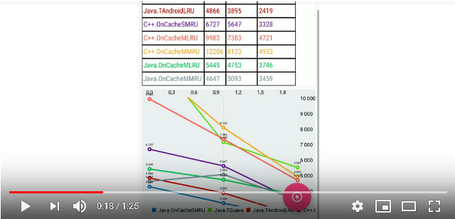
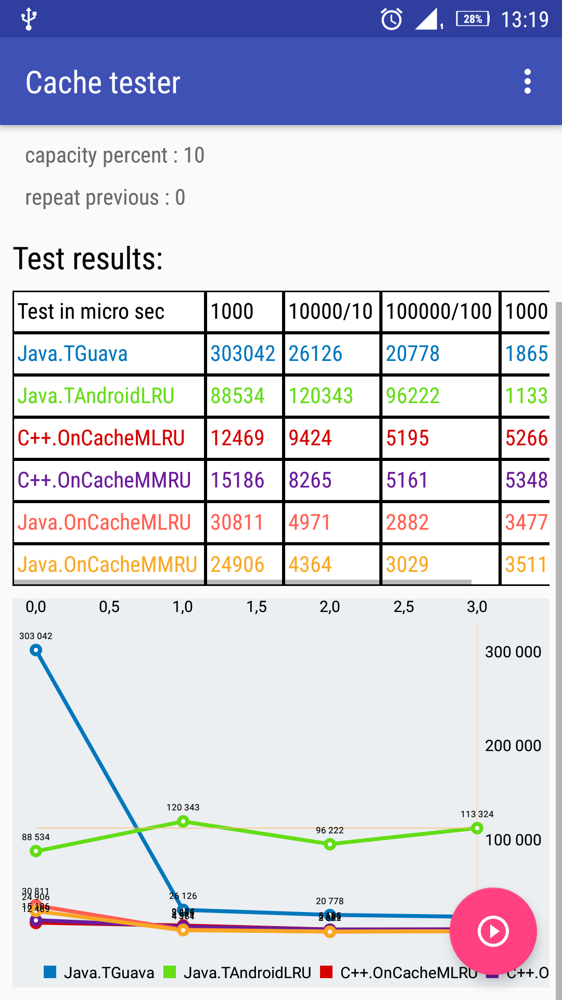

# android_cache
## Java vs C++ cache speed compare on Android

You are in the test bench repository where the fastest algorithms for multithreaded data caching are compared on Android OS. If you have your own variant of a thread-safe cache, please send me a link to its Java/C/C++ implementation (specnet.messenger@gmail.com) so that I can add it to the tests.

Step-by-step instructions on how to run a test using source code / ready-made compiled programs, bench description, description of caching algorithms [here: WiKi](https://github.com/DimaBond174/android_cache/wiki)

Finished compiled programs can be found [here: Artifactory](https://drive.google.com/open?id=1g0Rbjj443OxrTP09AxhMZJIEPhjg6usX)

## Video example of working with test bench:

---

## Examples of the test results.

### Key - number array search :

---

The graphs are aligned on the level of the first data block work time - the processing time for the 10 * first data block  is divided by 10 times, the processing time for the 100 * first data block is divided by 100 times and so on. If the graph remains parallel to the earth, this means O(n) time complexity.

---

Algorithms of series O(n)cacheXX_RU are Java/C++ templates consists of 1 file that you can freely use instead of multibyte caching libraries. You can check the speed of work yourself using the test bench of this repository. Have a nice work.

---
  Copyright (c) Dmitriy Bondarenko
  feel free to contact me: specnet.messenger@gmail.com

